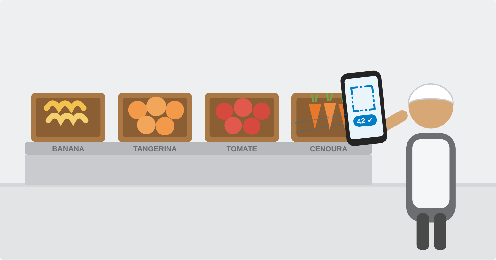

# Desafio Olho na Caixa: Kit de Apoio

 **Solutis - AI Center & LabS** · Em ativação de parceria com a: 
 **LIAO (Liga de Inteligência Artificial e Otimização)** formada por alunos da UFBA

> O desafio é usar criatividade e tecnologias de visão computacional para saber: **Quantas frutas realmente chegaram?**



Este repositório reúne o material de apoio para quem vai participar do **Desafio Olho na Caixa**: um desafio de visão computacional para responder, no ato do recebimento de produtos, quanto realmente chegou dentro das caixas de hortifruti para uma escola.

- 📄 Regulamento completo: `[Regulamento Completo.md](Regulamento Completo.md)`
- 📝 Formulário de inscrição e submissão: `[Formulário de inscrição](https://forms.cloud.microsoft/r/m6qLkbRGDw)`
- 💰 Prêmio: R$ 3.000 a R$ 5.000
- 📅 Publicação: 27/08/2026 · Prazo final: 02/10/2026, 23h59

## Estrutura deste repositório

```
assets/
  logo-solutis-principal.png      → identidade visual oficial da Solutis, usada neste README
  ilustracao-historia.png         → imagem meramente ilustrativa da história utilizada como contexto

kit-de-apoio/
  planilha_itens_contrato.csv     → lista de hortifruti com unidade de conferência de cada item
  referencia/        → (a preencher pela Solutis) fotos ou vídeos reais de recebimentos (permitido sintetizar fotos/vídeos com IA)
  
submissao-template/
  README.md                       → como organizar e nomear sua entrega
  documento_template.md           → esqueleto do documento de até 6 páginas exigido na submissão
```

## Os 4 itens obrigatórios (atenda pelo menos 2 dos 4)

| Item | Conferência | O que testa |
|---|---|---|
| Banana | por unidade | penca, com conversão para unidade |
| Tangerina | por unidade | a granel, empilhada, só a camada de cima é visível |
| Tomate | por peso (kg) | muitas peças pequenas, caixa densa |
| Cenoura | por peso (kg) | forma alongada, muitos vazios no empilhamento |

## Regras-chave (resumo: o regulamento oficial prevalece)

- Sem hardware específico instalado na escola. Balança comum (de 5 a 25 kg, sem integração digital) é permitida.
- Único meio de captura: celular comum, sem tripé ou acessório.
- Qualquer tecnologia de visão computacional é permitida.
- Mudar o processo de recebimento é permitido, desde que de baixa fricção.
- Margem de erro **obrigatória**, com método de cálculo explicado.
- Entrega final: documento (até 6 páginas), vídeo (até 5 min), código e material de captura usado na medição de acurácia.

## Dúvidas

Canal de dúvidas aberto durante todo o período do desafio: `[Teams / canal a definir]`

---

Solutis AI Center · Desafio Olho na Caixa · 2026
